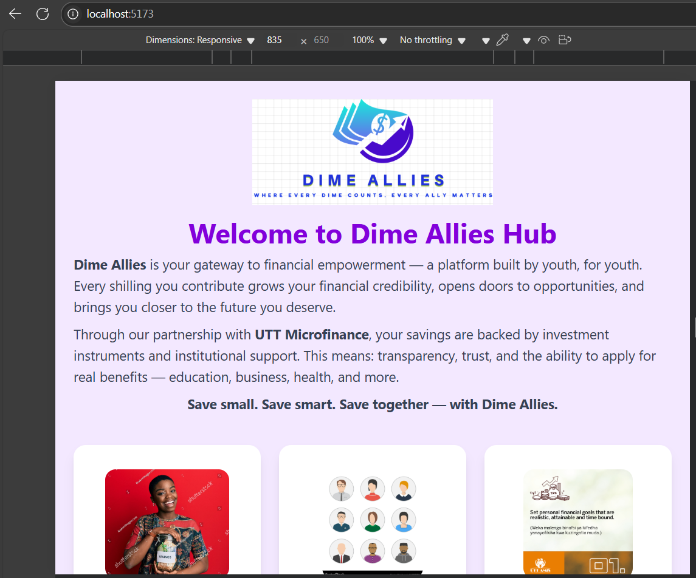
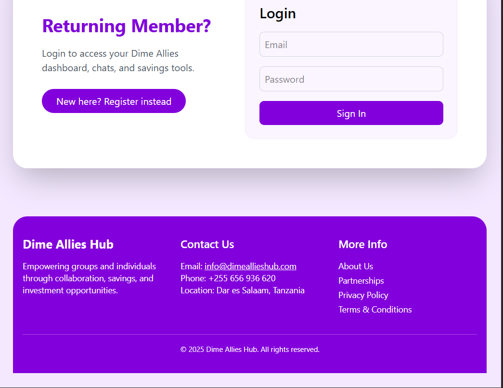
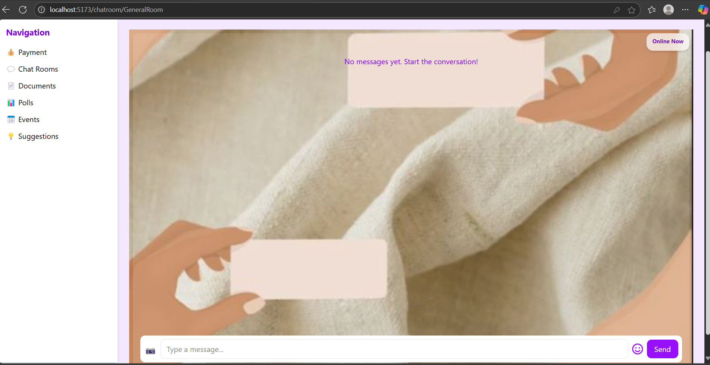

# 💬 Dime Allies Hub

**Dime Allies Hub** is a real-time collaborative platform for the UTT Dime Allies community. It enables seamless communication, event coordination, financial planning, and idea sharing via chat rooms, suggestions, polls, and document uploads. It includes secure authentication, protected routes, and beautiful Tailwind UI components.

---

## 📁 Project Structure

```
dime-allies-hub/
├── client/                  # Frontend (React + Tailwind)
│   ├── public/
│   ├── src/
│   │   ├── components/      # Reusable UI components (Navbar, Chat, etc.)
│   │   ├── context/         # Auth and Socket context
│   │   ├── pages/           # Main route pages (ChatRoom, Dashboard, Suggestions, etc.)
│   │   ├── services/        # Axios APIs and socket services
│   │   ├── App.jsx          # Main App with routing and ProtectedRoute
│   │   └── main.jsx         # Entry point
│   ├── tailwind.config.js
│   └── index.html
├── server/                  # Backend (Express + MongoDB)
│   ├── config/              # DB connection and socket setup
│   ├── controllers/         # Route logic (auth, messages, suggestions, etc.)
│   ├── models/              # Mongoose schemas (User, Message, Suggestion, etc.)
│   ├── routes/              # Express routes
│   ├── middleware/          # Auth and error middlewares
│   ├── server.js            # Entry point
│   └── .env                 # Environment variables
├── README.md                # Project Documentation
├── package.json             # Project scripts and metadata
└── mern-ci-cd.yml           # GitHub Actions CI/CD pipeline
```

---

## 🔧 Setup Instructions

1. **Clone the repo:**
```bash
git clone https://github.com/yourusername/dime-allies-hub.git
cd dime-allies-hub
```

2. **Install dependencies:**
```bash
cd client && pnpm install
cd ../server && pnpm install
```

3. **Set environment variables:**
Create `.env` file in `/server` with:
```env
MONGO_URI=your_mongo_connection_string
JWT_SECRET=your_secret_key
CLIENT_URL=http://localhost:5173
VITE_SOCKET_URL=http://localhost:5000
SENTRY_DSN=your_sentry_dsn
```

4. **Run the app locally:**
```bash
# Terminal 1
cd server
pnpm dev

# Terminal 2
cd client
pnpm dev
```
## 🖼️ Screenshots

## dashboard 


## Login/Register Forms


## Payment


## ChatRoom


---

## 🚀 Deployment

### 🔹 Backend on Render:
1. Go to [Render](https://render.com/), create new Web Service.
2. Connect GitHub, select `server/`, set build command `pnpm install` and start command `node server.js`.
3. Add environment variables from `.env`.

### 🔹 Frontend on Vercel:
1. Go to [Vercel](https://vercel.com/), import GitHub project.
2. Set root directory to `client/`.
3. Add `VITE_SOCKET_URL=https://your-render-backend-url` in environment variables.

---

## 🧪 Testing & Debugging

### ✅ Frontend Testing:
- Unit & component tests using `Jest` and `React Testing Library`.

### ✅ Backend Testing:
- API route tests using `Jest` + `Supertest`.

### 🐞 Debugging:
- Installed and configured [Sentry](https://sentry.io/) for both backend and frontend.
- Errors are logged in Sentry dashboard for monitoring.

### 🔍 Health Check:
- Endpoint: `GET /api/health` to verify backend status.

---

## 🛡️ Protected Routes

- Used a `ProtectedRoute` wrapper in `App.jsx`.
- Only authenticated users can access `/chat`, `/suggestions`, `/polls`, etc.

---

## 📚 API Documentation

### Auth Routes
| Method | Endpoint        | Description           |
|--------|------------------|------------------------|
| POST   | `/api/auth/login` | Login user            |
| POST   | `/api/auth/register` | Register user     |

### Suggestions
| Method | Endpoint                      | Description                 |
|--------|-------------------------------|-----------------------------|
| GET    | `/api/suggestions`            | Fetch all suggestions       |
| POST   | `/api/suggestions`            | Submit new suggestion       |
| POST   | `/api/suggestions/:id/upvote` | Upvote a suggestion         |

> Similar routes exist for `/api/events`, `/api/polls`, `/api/documents`, and `/api/messages`.

---

## 🧠 Features

- 🔒 Authentication (Login/Register)
- 💬 Chat Rooms (General and Leaders Corner)
- 📷 Image Uploads and Reactions
- 💡 Suggestions Board with Upvotes
- 📊 Polls & Surveys (coming)
- 📁 Document Sharing
- 📅 Events Page

---

## 🔗 Live Links

- 🌐 Frontend (Vercel): [https://dime-allies-frontend.vercel.app](https://dime-allies-frontend.vercel.app)
- ⚙️ Backend (Render): [https://dime-allies-api.onrender.com](https://dime-allies-api.onrender.com)

---

### 📊 Monitoring Tools

- **UptimeRobot**:  
  - Monitors:
    - Frontend: `https://week-7-devops-deployment-assignment-lilac.vercel.app/`
    - Backend Health: `https://week-7-devops-deployment-assignment-stci.onrender.com/api/health`
  - Sends email alerts if downtime occurs
- **Sentry**:
  - Error tracking set up for both frontend and backend
  - Helps detect and fix runtime issues
- **Health Check**:  
  - Backend `/api/health` route responds with status and uptime

### 🛠️ Maintenance Plan

- **Regular Updates**:
  - Keep dependencies up-to-date using `npm outdated` or `pnpm update`
- **Security Patches**:
  - Monitor for critical vulnerabilities using GitHub security alerts
- **Database Backups**:
  - Export MongoDB regularly (use MongoDB Atlas or CLI backup tools)
- **Scheduled Checks**:
  - Weekly review of Sentry logs and uptime reports
  - Monthly review of deployment configurations and server usage

---
## Pitch deck for Dime Allies Hub

[Pitch deck](C:\Users\dell\Desktop\Final Project\week-8-capstone_-Lutty112\Dime Allies- Pitch deck.pptx)

---

## 👨‍💻 Author

Made with ❤️ by [Lutfia Mosi]

GitHub Account [Lutty112]

---

## 📃 License

MIT License
